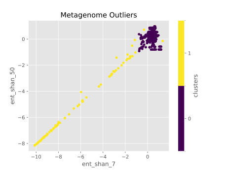
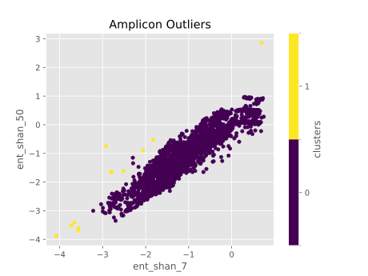
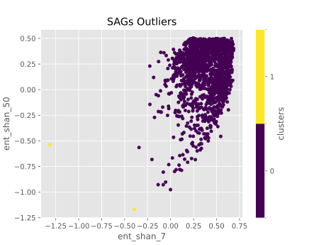
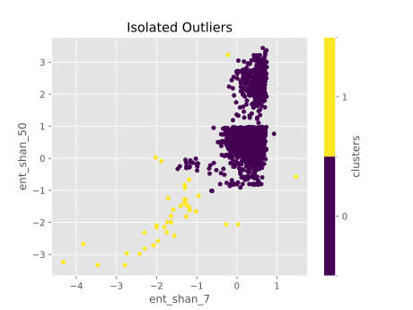

## Outlier detection
Although we did our best to prepare reliable metadata for the training data, some mistakes have probably happened.
An outlier detection model has been developed for more deep investigation of training data, and the outlier has been reconsidered by experts again.
For detecting the outliers a DBscan model was implemented, and the outcomes are illustrated in the below figures.
.
.
.
.

These figures illustrated that there are some unreliable data that biologist experts should reinvestigate. 
